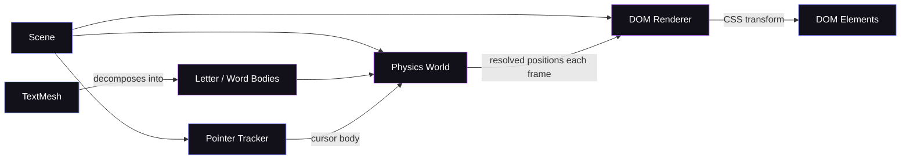

<div align="center">

<a href="https://github.com/sxwik/textmesh">

</a>

<br/>
<br/>

<svg width="100" height="100" viewBox="0 0 100 100" fill="none" xmlns="http://www.w3.org/2000/svg">
  <rect width="100" height="100" rx="24" fill="#0A0A0A"/>
  <rect x="1" y="1" width="98" height="98" rx="23" stroke="url(#g1)" stroke-width="1.5"/>
  <text x="12" y="64" font-family="monospace" font-weight="900" font-size="46" fill="white">T</text>
  <text x="48" y="64" font-family="monospace" font-weight="900" font-size="46" fill="url(#g2)">M</text>
  <defs>
    <linearGradient id="g1" x1="0" y1="0" x2="100" y2="100" gradientUnits="userSpaceOnUse">
      <stop offset="0%" stop-color="#6366F1"/>
      <stop offset="100%" stop-color="#A855F7"/>
    </linearGradient>
    <linearGradient id="g2" x1="48" y1="18" x2="100" y2="70" gradientUnits="userSpaceOnUse">
      <stop offset="0%" stop-color="#818CF8"/>
      <stop offset="100%" stop-color="#C084FC"/>
    </linearGradient>
  </defs>
</svg>

<br/>
<br/>

# TextMesh

**DOM physics for typography.**

*HTML text that collides, falls, and reacts — without ever leaving the DOM.*

<br/>

[](https://npmjs.com/package/@sxwik/textmesh)
[](./LICENSE)
[](https://github.com/sxwik/textmesh/stargazers)
[](https://typescriptlang.org)

<br/>

```bash
npm install @sxwik/textmesh
```

<br/>

[**npm**](https://npmjs.com/package/@sxwik/textmesh) &nbsp;·&nbsp; [**GitHub**](https://github.com/sxwik/textmesh)

</div>

---

## Table of Contents

- [Why TextMesh Exists](#why-textmesh-exists)
- [The Idea](#the-idea)
- [What Never Changes](#what-never-changes)
- [Installation](#installation)
- [Quick Start](#quick-start)
- [How It Works](#how-it-works)
- [Core Primitives](#core-primitives)
- [React](#react)
- [Comparison](#comparison)
- [Project Structure](#project-structure)
- [Roadmap](#roadmap)
- [Contributing](#contributing)
- [FAQ](#faq)
- [License](#license)

---

## Why TextMesh Exists

CSS animations animate values.

Game engines simulate worlds.

**TextMesh brings those worlds to typography.**

---

Letters stop being pixels arranged in a font.
They become objects — with mass, velocity, and inertia.

The cursor stops being a pointer.
It becomes a body that exerts force on text.

Your heading stops being static.
It *reacts*.

And through all of it, **the DOM stays intact.**
Text remains selectable, accessible, styled with CSS, and indexed by search engines.

Not every problem needs WebGL.

---

## The Idea

```
  without TextMesh
  ─────────────────────────────────────────────

              cursor
                │
                ↓

          H  E  L  L  O

  Nothing happens.
  Text is static. Pixels on a screen.
  The cursor and the letters don't know each other exist.
```

```
  with TextMesh
  ─────────────────────────────────────────────

              cursor  ←  physics body
                │
                ↓
             ↙     ↘

    H       E       L       L       O

    ↓       ↓       ↓       ↓       ↓

    gravity · collision · restitution · drag

    Still an <h1>. Still selectable. Still in the DOM.
```

The code difference is equally small:

```diff
- <h1>Hello, World.</h1>

+ const scene = new Scene({ container, gravity })
+ scene.add(new TextMesh('Hello, World.', { split: 'letters' }))
+ scene.start()
```

---

## What Never Changes

TextMesh never moves text to Canvas or WebGL. Letters are real DOM nodes, always.

|  | Default DOM | Canvas / WebGL | TextMesh |
|---|---|---|---|
| Text selectable | ✅ | ❌ | ✅ |
| Screen reader support | ✅ | ❌ | ✅ |
| CSS styling | ✅ | ❌ | ✅ |
| SEO indexable | ✅ | ❌ | ✅ |
| Native font rendering | ✅ | ❌ | ✅ |
| Cursor collision | ❌ | ✅ | ✅ |
| Per-letter physics | ❌ | ✅ | ✅ |

The browser renders the font. TextMesh moves it.

---

## Installation

```bash
# npm
npm install @sxwik/textmesh

# pnpm
pnpm add @sxwik/textmesh

# bun
bun add @sxwik/textmesh

# yarn
yarn add @sxwik/textmesh
```

---

## Quick Start

### Vanilla JavaScript

```typescript
import { Scene, TextMesh } from '@sxwik/textmesh'

const scene = new Scene({
  container: document.getElementById('app'),
  gravity: { x: 0, y: 980 },
})

scene.add(new TextMesh('Hello, Physics.', {
  split: 'letters',   // decompose into one body per letter
  physics: {
    restitution: 0.6, // bounciness — 0 = dead stop, 1 = perfect bounce
    friction: 0.4,    // surface resistance
    draggable: true,  // cursor can grab and throw letters
  },
}))

scene.start()
```

Every letter becomes an independent rigid body.
The cursor pushes them. Gravity pulls them. They collide with each other.
The underlying DOM elements are still your `<h1>`.

### React

```tsx
import { PhysicsText } from '@sxwik/textmesh-react'

export default function Hero() {
  return (
    <PhysicsText split="letters" gravity draggable>
      BUILD THE WEB DIFFERENTLY
    </PhysicsText>
  )
}
```

---

## How It Works



**No canvas. No WebGL. No external physics library.**

The physics engine is written specifically for TextMesh. Each tick, it integrates forces, resolves collisions, and writes the result back to DOM element transforms. The browser handles font rendering. TextMesh handles position.

---

## Core Primitives

### Scene

The root of a TextMesh world. A Scene owns the physics world, the renderer, the update loop, and pointer tracking. Give it a container element and start it.

```typescript
const scene = new Scene({
  container: document.getElementById('app'),
  gravity: { x: 0, y: 980 },
})

scene.add(mesh)
scene.start()
scene.pause()
scene.resume()
scene.destroy()
```

### TextMesh

The main primitive. A TextMesh takes a string, decomposes it into physics bodies at the granularity you choose, and connects each body to a real DOM element.

```typescript
const mesh = new TextMesh('TextMesh', {
  split: 'letters',   // 'letters' | 'words'
  physics: {
    restitution: 0.6,
    friction: 0.3,
    draggable: true,
  },
})
```

When `split: 'letters'`, each character is an independent rigid body.
When `split: 'words'`, each word moves as a single unit.

### Physics

TextMesh implements its own physics engine — purpose-built for DOM typography.

**Gravity** — bodies fall in a configurable direction and magnitude.

**Collision detection** — letters detect and respond to each other and to scene boundaries.

**Restitution** — how much kinetic energy is preserved on impact. At `1.0`, letters bounce indefinitely. At `0.0`, they land dead.

**Friction** — resistance to sliding. Controls behavior when letters stack or slide across a boundary.

**Dragging** — any letter can be grabbed with the cursor and thrown. Release velocity carries into the simulation.

### Pointer

The cursor is a physics object in the scene. When it enters a letter's proximity, it exerts a repulsive force. Letters scatter outward. When the cursor leaves, gravity and friction settle them back.

```
  cursor moves over text

  ←  H        O  →
    ↖ E      L ↗
        ↑  ↑
        L  L
        
  forces are proportional to overlap
  each letter responds independently
```

---

## React

TextMesh ships a first-party React package.

```bash
npm install @sxwik/textmesh-react
```

```tsx
import { PhysicsText } from '@sxwik/textmesh-react'

// Letters scatter on cursor contact
<PhysicsText split="letters" gravity draggable>
  Text that reacts.
</PhysicsText>
```

The React package wraps the core engine in components that manage scene lifecycle automatically. The Scene is created on mount and destroyed on unmount. No manual cleanup.

---

## Comparison

What makes TextMesh different from the tools you already use.

|  | CSS | GSAP / Motion | Canvas / WebGL | TextMesh |
|---|---|---|---|---|
| Real physics simulation | ❌ | ❌ | ✅ | ✅ |
| Text stays in DOM | ✅ | ✅ | ❌ | ✅ |
| CSS applies | ✅ | ✅ | ❌ | ✅ |
| Screen reader support | ✅ | ✅ | ❌ | ✅ |
| Per-letter physics | ❌ | ❌ | ✅ | ✅ |
| Cursor collision | ❌ | ❌ | ✅ | ✅ |
| Zero dependencies | ✅ | ❌ | ❌ | ✅ |

CSS and animation libraries animate values. TextMesh simulates matter.
Canvas and WebGL simulate matter but abandon the DOM. TextMesh does neither.

---

## Project Structure

```
textmesh/
├── packages/
│   ├── core/          # scene, TextMesh, decomposition logic
│   ├── physics/       # physics engine — integration, collision, bodies
│   ├── renderer/      # DOM renderer — CSS transform writes
│   ├── react/         # @sxwik/textmesh-react — React components
│   └── textmesh/      # main package — re-exports core + renderer + physics
├── CONTRIBUTING.md
├── LICENSE
└── README.md
```

---

## Roadmap

### Shipped ✅

- [x] Physics engine — gravity, collision, restitution, friction
- [x] Letter and word decomposition
- [x] Pointer interaction — cursor as a physics body
- [x] Dragging
- [x] DOM renderer — CSS transform-based, no canvas
- [x] React package

### Planned

- [ ] Magnetic fields — attract and repel text bodies
- [ ] Fluid simulation — text drift and flow
- [ ] Soft body deformation
- [ ] Snapshot / restore
- [ ] Vue package
- [ ] Svelte package
- [ ] WebWorker physics offload
- [ ] Visual playground
- [ ] Documentation site

---

## Contributing

TextMesh is open source and early. Contributions are welcome.

```bash
git clone https://github.com/sxwik/textmesh
cd textmesh
pnpm install
pnpm build
pnpm test
```

**What's useful right now:**
- Bug reports with minimal reproductions
- Performance improvements with measured benchmarks
- Physics edge cases — stacking, high-velocity tunneling, sleeping bodies
- Tests for the physics engine
- Documentation and real-world examples

Open an issue before opening a PR for any substantial change.
Code is TypeScript strict mode throughout. No `any`.

---

## FAQ

<details>
<summary><b>Does TextMesh use Canvas or WebGL?</b></summary>

No. Text lives in the DOM as real HTML elements throughout. TextMesh writes only `transform: translate(x, y) rotate(angle)` on each physics tick. The browser handles layout, font rendering, and painting. Nothing moves to a canvas surface.

</details>

<details>
<summary><b>Will screen readers still work?</b></summary>

Yes. Because letters are real DOM nodes, screen readers read them normally. TextMesh does not affect the accessibility tree or ARIA roles.

</details>

<details>
<summary><b>Can I still use CSS to style the text?</b></summary>

Yes. TextMesh only writes `transform`. Your `color`, `font-size`, `font-family`, `letter-spacing`, `text-shadow`, and any other CSS properties are untouched. Add hover states, transitions, and custom properties freely.

</details>

<details>
<summary><b>Does it affect SEO?</b></summary>

No. Text remains in the DOM as standard HTML, readable by search engine crawlers the same as it would be without TextMesh.

</details>

<details>
<summary><b>What physics engine does it use internally?</b></summary>

TextMesh ships its own purpose-built physics engine. There is no dependency on Matter.js, Box2D, Rapier, Cannon, or any other physics library. The engine was written specifically for the constraints of DOM typography.

</details>

<details>
<summary><b>Does it work with custom fonts?</b></summary>

Yes. TextMesh measures glyph dimensions after fonts are loaded. Load your font via `@font-face` or a web font provider before calling `scene.start()` and TextMesh will use the correct bounding boxes.

</details>

<details>
<summary><b>Is text still selectable while the simulation runs?</b></summary>

When bodies are at rest, text is fully selectable. During active cursor interaction or dragging, pointer capture may temporarily prevent selection — the same as any drag interaction on the web.

</details>

<details>
<summary><b>Can I use it without a bundler?</b></summary>

Not yet. ESM and UMD CDN builds are planned. For now, a bundler (Vite, Webpack, esbuild) is required.

</details>

---

## License

MIT © [Satwik](https://github.com/sxwik)

---

<div align="center">

<br/>

[](https://npmjs.com/package/@sxwik/textmesh)
[](https://github.com/sxwik)

<br/>

**Text stays HTML. Physics happens to it.**

<br/>

*If TextMesh gave you an idea — give it a ⭐*

</div>
