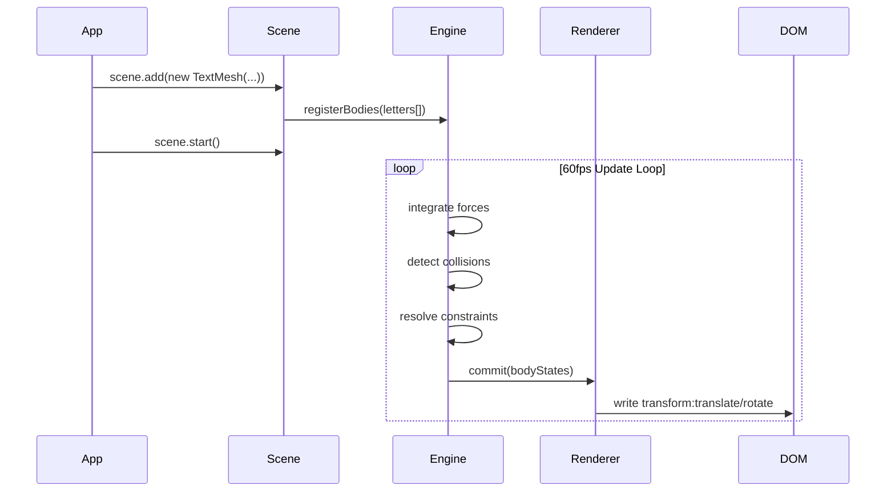

<div align="center">

<!-- ANIMATED SVG HEADER -->
<a href="https://github.com/sxwik/textmesh">

</a>

<br/>
<br/>

<!-- LOGO SVG -->
<svg width="120" height="120" viewBox="0 0 120 120" fill="none" xmlns="http://www.w3.org/2000/svg">
  <rect width="120" height="120" rx="28" fill="#0A0A0A"/>
  <rect x="1" y="1" width="118" height="118" rx="27" stroke="url(#grad)" stroke-width="1.5"/>
  <text x="18" y="72" font-family="monospace" font-weight="900" font-size="52" fill="white">T</text>
  <text x="54" y="72" font-family="monospace" font-weight="900" font-size="52" fill="url(#grad2)">M</text>
  <defs>
    <linearGradient id="grad" x1="0" y1="0" x2="120" y2="120" gradientUnits="userSpaceOnUse">
      <stop offset="0%" stop-color="#6366F1"/>
      <stop offset="100%" stop-color="#A855F7"/>
    </linearGradient>
    <linearGradient id="grad2" x1="54" y1="20" x2="110" y2="80" gradientUnits="userSpaceOnUse">
      <stop offset="0%" stop-color="#818CF8"/>
      <stop offset="100%" stop-color="#C084FC"/>
    </linearGradient>
  </defs>
</svg>

<br/>
<br/>

# TextMesh

**Interactive physics-based typography engine for the modern web.**

*Letters with mass. Words with velocity. Paragraphs with inertia.*

<br/>

[](https://npmjs.com/package/@sxwik/textmesh)
[](https://npmjs.com/package/@sxwik/textmesh)
[](https://bundlephobia.com/package/@sxwik/textmesh)
[](./LICENSE)
[](https://github.com/sxwik/textmesh/stargazers)
[](https://typescriptlang.org)
[](https://bundlephobia.com/package/@sxwik/textmesh)

<br/>

[**Documentation**](https://textmesh.dev/docs) · [**Playground**](https://textmesh.dev/play) · [**Examples**](https://textmesh.dev/examples) · [**GitHub**](https://github.com/sxwik/textmesh)

<br/>

```bash
npm install @sxwik/textmesh
```

<br/>

<!-- HERO VISUAL -->
<picture>
  <source media="(prefers-color-scheme: dark)" srcset="https://raw.githubusercontent.com/sxwik/textmesh/main/media/hero-dark.gif">
  
</picture>

<br/>
<br/>

</div>

---

<div align="center">

> **TextMesh is not an animation library.**
>
> It is a DOM physics engine where text behaves like real objects —
> with mass, velocity, friction, restitution, and forces.

</div>

---

## Table of Contents

<details>
<summary><b>Expand</b></summary>

- [Installation](#-installation)
- [Quick Start](#-quick-start)
- [Live Demos](#-live-demos)
- [Features](#-features)
- [Why TextMesh?](#-why-textmesh)
- [Architecture](#-architecture)
- [Core Components](#-core-components)
- [Plugin System](#-plugin-system)
- [Framework Examples](#-framework-examples)
- [Advanced API](#-advanced-api)
- [Benchmarks](#-benchmarks)
- [Comparison](#-comparison)
- [Roadmap](#-roadmap)
- [Project Structure](#-project-structure)
- [Contributing](#-contributing)
- [FAQ](#-faq)
- [Acknowledgements](#-acknowledgements)
- [License](#-license)

</details>

---

## ⚡ Installation

<details open>
<summary><b>Package Managers</b></summary>

<br/>

```bash
# npm
npm install @sxwik/textmesh

# pnpm
pnpm add @sxwik/textmesh

# bun
bun add @sxwik/textmesh

# yarn
yarn add @sxwik/textmesh
```

</details>

<details>
<summary><b>CDN (no build step)</b></summary>

<br/>

```html
<!-- ESM via jsDelivr -->
<script type="module">
  import { Scene, TextMesh } from 'https://cdn.jsdelivr.net/npm/@sxwik/textmesh/dist/index.esm.js'
</script>

<!-- UMD global -->
<script src="https://cdn.jsdelivr.net/npm/@sxwik/textmesh/dist/index.umd.js"></script>
```

</details>

<details>
<summary><b>Requirements</b></summary>

<br/>

| Requirement | Version |
|---|---|
| Node.js | `≥ 18.0.0` |
| Browser | Modern (Chrome 90+, Firefox 90+, Safari 15+) |
| TypeScript | `≥ 5.0` (optional but recommended) |

</details>

---

## 🚀 Quick Start

The simplest TextMesh scene — letters that fall, collide, and bounce.

```typescript
import { Scene, TextMesh } from '@sxwik/textmesh'

// Create a physics scene bound to a DOM container
const scene = new Scene({
  container: document.getElementById('app'),
  gravity: { x: 0, y: 980 },
})

// Give a heading real physics
const title = new TextMesh('Hello, Physics.', {
  fontSize: 64,
  fontWeight: 900,
  physics: {
    restitution: 0.6,   // bounciness
    friction: 0.3,
    density: 1.2,
  },
})

scene.add(title)
scene.start()
```

> Every letter is an independent rigid body. No canvas. No WebGL. Pure DOM.

---

## 🎮 Live Demos

Eight physics modes. Each one is a different way text can feel alive.

<br/>

### 🌊 Gravity

Letters obey gravity — they fall, stack, and settle. Adjust `gravity.y`, `restitution`, and `friction` to tune the world.

<div align="center">

</div>

```typescript
const scene = new Scene({ gravity: { x: 0, y: 1200 } })
scene.add(new TextMesh('FALL', { physics: { restitution: 0.8 } }))
scene.start()
```

<br/>

---

### 🖱️ Cursor Collision

Text reacts to the cursor in real time. Letters scatter on hover, return on idle.

<div align="center">

</div>

```typescript
import { Scene, TextMesh, PointerCollider } from '@sxwik/textmesh'

const scene = new Scene({ gravity: { x: 0, y: 0 } })
scene.use(new PointerCollider({ radius: 48, force: 800 }))
scene.add(new TextMesh('INTERACT', { physics: { restitution: 0.9 } }))
scene.start()
```

<br/>

---

### 🌀 Springs

Letters are tethered to anchor points by configurable spring joints. Drag one — the rest follow.

<div align="center">

</div>

```typescript
const mesh = new TextMesh('ELASTIC', {
  physics: {
    joints: 'spring',
    spring: { stiffness: 200, damping: 12 },
  },
})
```

<br/>

---

### 💥 Explosion

Trigger a radial force burst from any point. Letters fly outward with realistic impulse.

<div align="center">

</div>

```typescript
scene.explode({
  origin: { x: 400, y: 300 },
  force: 2000,
  radius: 200,
  falloff: 'linear',
})
```

<br/>

---

### 🧲 Magnetic Text

Letters are attracted or repelled by magnetic fields you define. Build orbits, vortices, and lenses.

<div align="center">

</div>

```typescript
import { MagneticField } from '@sxwik/textmesh'

scene.addField(new MagneticField({
  position: { x: 400, y: 300 },
  strength: 1200,
  polarity: 'attract',
  falloff: 'inverse-square',
}))
```

<br/>

---

### ✋ Dragging

Every letter is individually draggable. Drop it into a pile. Build a physics playground.

<div align="center">

</div>

```typescript
const mesh = new TextMesh('DRAG ME', {
  physics: { draggable: true, restitution: 0.5 },
})
```

<br/>

---

### 🫧 Soft Body

Letters deform on impact. Vertices push inward, then recover. Text that breathes.

<div align="center">

</div>

```typescript
const mesh = new TextMesh('SOFT', {
  physics: {
    body: 'soft',
    softness: 0.7,
    recovery: 0.4,
  },
})
```

<br/>

---

### ⚡ Fluid Simulation

Text floats inside a velocity field. Letters drift, eddy, and swirl like particles in a current.

<div align="center">

</div>

```typescript
import { FluidField } from '@sxwik/textmesh'

scene.addField(new FluidField({
  flow: { x: 120, y: -40 },
  turbulence: 0.3,
  viscosity: 0.8,
}))
```

---

## ✦ Features

<div align="center">

| Feature | Description |
|---|---|
| 🔬 **DOM-native physics** | No canvas, no WebGL — letters are real DOM elements with real positions |
| 🔤 **Granular decomposition** | Physics at letter, word, or paragraph granularity |
| ⚡ **60fps by default** | Optimized update loop with adaptive timestep |
| 🧩 **Plugin architecture** | Drop in force fields, collision handlers, and renderers |
| 🎯 **Zero dependencies** | No Matter.js, no Box2D — physics engine written from scratch |
| 🌊 **Force fields** | Gravity, magnetic, fluid, vortex, and custom vector fields |
| 🤏 **Pointer integration** | Cursor hover, drag, click — all fire physics impulses |
| 🔁 **Reversible** | Every physics operation is snapshottable and replayable |
| 🎨 **Style-preserving** | Your CSS survives. TextMesh only controls `transform` |
| 📦 **Tree-shakeable** | Import only what you use. Base is 7.2 KB gzipped |
| 🔧 **TypeScript-first** | Full types, strict mode, generics throughout |
| ♿ **Accessible** | `prefers-reduced-motion` respected by default |

</div>

---

## 🤔 Why TextMesh?

Most developers reach for CSS transitions, then animation libraries, then WebGL when they want moving text. Each step adds complexity. None of them model physics.

```
Traditional CSS
───────────────
✓ Simple keyframes
✗ No inter-element interaction
✗ No forces or impulses
✗ Feels mechanical, not physical

     ↓

Animation Libraries (GSAP / Motion / Anime.js)
──────────────────────────────────────────────
✓ Easing curves feel natural
✓ Timeline coordination
✗ Still keyframe-driven
✗ Letters don't know each other exist
✗ "Physics" is just ease functions

     ↓

WebGL / Canvas (Three.js / Pixi.js)
────────────────────────────────────
✓ Actual simulation
✗ Text leaves the DOM entirely
✗ No CSS, no accessibility, no selectability
✗ Enormous bundle, complex setup
✗ You're rendering fonts yourself

     ↓

TextMesh
────────
✓ Real physics simulation
✓ Letters stay in the DOM
✓ Your CSS still applies
✓ Accessible and selectable
✓ No WebGL required
✓ 7.2 KB gzipped
```

TextMesh is the first layer of the stack that treats text as matter.

---

## 🏗️ Architecture

How a `scene.start()` becomes letters bouncing off your cursor.

```mermaid
graph TD
    A[DOM Container] -->|mounted into| B[Scene]
    B --> C[Engine]
    B --> D[Renderer]
    B --> E[PointerTracker]

    C --> F[PhysicsWorld]
    F --> G[BroadPhase Collision]
    F --> H[NarrowPhase Solver]
    F --> I[Force Integrator]
    F --> J[Constraint Solver]

    D --> K[TransformWriter]
    K -->|writes transform| L[DOM Elements]

    E --> M[PointerBody]
    M -->|impulse| F

    B --> N[Update Loop]
    N -->|tick| C
    N -->|commit| D

    style A fill:#1a1a2e,stroke:#6366F1
    style B fill:#16213e,stroke:#6366F1
    style C fill:#0f3460,stroke:#A855F7
    style D fill:#0f3460,stroke:#A855F7
    style F fill:#533483,stroke:#C084FC
    style N fill:#533483,stroke:#C084FC
```

```mermaid
graph LR
    subgraph TextMesh Decomposition
        TM[TextMesh] --> WM1[WordMesh: Hello]
        TM --> WM2[WordMesh: Physics]
        WM1 --> LM1[LetterMesh: H]
        WM1 --> LM2[LetterMesh: e]
        WM1 --> LM3[LetterMesh: l]
        WM1 --> LM4[LetterMesh: l]
        WM1 --> LM5[LetterMesh: o]
    end

    subgraph Physics Bodies
        LM1 --> PB1[PhysicsBody]
        LM2 --> PB2[PhysicsBody]
        LM3 --> PB3[PhysicsBody]
    end

    style TM fill:#1e1b4b,stroke:#818CF8
    style WM1 fill:#1e1b4b,stroke:#A855F7
    style WM2 fill:#1e1b4b,stroke:#A855F7
```







---

## 🧱 Core Components

<details open>
<summary><b>Scene</b> — the root container</summary>

<br/>

The `Scene` mounts into a DOM element and owns the update loop, renderer, and physics world.

```typescript
import { Scene } from '@sxwik/textmesh'

const scene = new Scene({
  container: document.getElementById('app'),   // required
  gravity: { x: 0, y: 980 },                  // pixels/s²
  bounds: 'container',                         // 'container' | 'window' | BoundsRect
  substeps: 8,                                 // physics accuracy
  debug: false,                                // render collision shapes
  background: 'transparent',
  onTick: (dt, bodies) => {},                  // raw tick hook
})

// Lifecycle
scene.start()
scene.pause()
scene.resume()
scene.destroy()

// Manipulation
scene.add(mesh)
scene.remove(mesh)
scene.clear()
scene.snapshot()   // → SceneSnapshot
scene.restore(snapshot)

// Forces
scene.applyGravity({ x: 0, y: 600 })
scene.explode({ origin, force, radius })
scene.addField(field)
scene.removeField(field)
```

</details>

<details>
<summary><b>Engine</b> — the physics simulation</summary>

<br/>

The `Engine` runs the integration loop and collision pipeline. You rarely use it directly, but it's fully accessible.

```typescript
import { Engine } from '@sxwik/textmesh'

const engine = new Engine({
  substeps: 8,
  gravity: { x: 0, y: 980 },
  sleeping: true,       // auto-sleep idle bodies
  broadphase: 'grid',   // 'grid' | 'sweep' | 'brute'
})

// Direct access
engine.bodies           // Map<id, PhysicsBody>
engine.constraints      // Constraint[]
engine.fields           // ForceField[]

engine.step(dt: number) // manual tick
engine.on('collision', ({ bodyA, bodyB, normal, depth }) => {})
engine.on('sleep', (body) => {})
engine.on('wake', (body) => {})
```

</details>

<details>
<summary><b>TextMesh</b> — a string of text with physics</summary>

<br/>

The main primitive. One `TextMesh` per text node. Decomposes into `WordMesh` and `LetterMesh` automatically.

```typescript
import { TextMesh } from '@sxwik/textmesh'

const mesh = new TextMesh('TextMesh', {
  // Typography
  fontSize: 72,
  fontWeight: 900,
  fontFamily: 'Inter',
  letterSpacing: -0.02,
  color: '#ffffff',

  // Layout
  position: { x: 100, y: 100 },
  align: 'center',

  // Physics
  physics: {
    granularity: 'letter',    // 'text' | 'word' | 'letter'
    density: 1.0,
    restitution: 0.6,
    friction: 0.3,
    angularDamping: 0.5,
    linearDamping: 0.1,
    isStatic: false,
    draggable: true,
    collisionFilter: {
      category: 0x0001,
      mask: 0xFFFF,
    },
  },

  // Events
  onCollision: (letter, other, impulse) => {},
  onDragStart: (letter) => {},
  onDragEnd: (letter) => {},
  onSleep: (letter) => {},
})

// After adding to scene
mesh.letters          // LetterMesh[]
mesh.words            // WordMesh[]
mesh.bodies           // PhysicsBody[]

// Methods
mesh.applyForce({ x: 0, y: -500 })
mesh.applyImpulse({ x: 800, y: 0 })
mesh.setStatic(true)
mesh.reset()          // return to original position
mesh.explode(force)   // scatter all letters
```

</details>

<details>
<summary><b>LetterMesh</b> — a single character with a physics body</summary>

<br/>

Each character in a `TextMesh` is represented as a `LetterMesh`. Access and manipulate them individually.

```typescript
const letter = mesh.letters[0]

letter.char           // 'T'
letter.body           // PhysicsBody
letter.element        // HTMLElement (the real DOM node)
letter.bounds         // DOMRect

// Individual impulse
letter.body.applyImpulse({ x: 0, y: -400 })

// Style override
letter.element.style.color = '#6366F1'

// Freeze/unfreeze
letter.body.isStatic = true
```

</details>

<details>
<summary><b>WordMesh</b> — a word as a grouped physics body</summary>

<br/>

When `granularity: 'word'`, each word is a single rigid body rather than individual letters.

```typescript
const word = mesh.words[0]

word.text             // 'TextMesh'
word.letters          // LetterMesh[]
word.body             // PhysicsBody (single body for the whole word)
word.bounds           // DOMRect

word.body.applyForce({ x: 200, y: 0 })
```

</details>

<details>
<summary><b>ParagraphMesh</b> — multi-line text with physics per line</summary>

<br/>

```typescript
import { ParagraphMesh } from '@sxwik/textmesh'

const para = new ParagraphMesh(`
  Physics for text.
  Letters with mass.
  Words with weight.
`, {
  fontSize: 24,
  lineHeight: 1.6,
  physics: {
    granularity: 'line',
    restitution: 0.4,
  },
})

scene.add(para)

para.lines    // TextMesh[] — one per line
```

</details>

<details>
<summary><b>PhysicsBody</b> — the raw simulation primitive</summary>

<br/>

Every letter, word, or text node is backed by a `PhysicsBody`. Access it directly for low-level control.

```typescript
const body = letter.body

// State
body.position        // { x, y }
body.velocity        // { x, y }
body.angle           // radians
body.angularVelocity // radians/s
body.mass            // kg (virtual)
body.inertia
body.bounds          // AABB

// Material
body.restitution     // 0–1
body.friction        // 0–1
body.density

// Control
body.applyForce(vec2)
body.applyImpulse(vec2)
body.setVelocity(vec2)
body.setPosition(vec2)
body.setAngle(rad)
body.isStatic
body.isSleeping

// Events
body.on('collide', handler)
body.on('sleep', handler)
body.on('wake', handler)
```

</details>

---

## 🔌 Plugin System

TextMesh is extensible via plugins. A plugin is an object with `install(scene)` and optionally `uninstall(scene)`.

```
@sxwik/textmesh
├── Scene
├── Engine
├── Renderer
├── plugins/
│   ├── PointerCollider     — cursor physics
│   ├── MagneticField       — attract / repel
│   ├── FluidField          — flow and drag
│   ├── VortexField         — rotational field
│   ├── WindField           — directional turbulence
│   ├── SpringConstraint    — elastic joints
│   ├── WallBounds          — container walls
│   ├── AttractorGroup      — letter → letter gravity
│   └── AudioReactive       — physics driven by audio FFT
```

<details>
<summary><b>Writing a custom plugin</b></summary>

<br/>

```typescript
import type { Plugin, Scene } from '@sxwik/textmesh'

const MyPlugin: Plugin = {
  name: 'my-plugin',
  install(scene: Scene) {
    const handler = () => {
      scene.engine.bodies.forEach(body => {
        body.applyForce({ x: Math.sin(Date.now() / 1000) * 100, y: 0 })
      })
    }
    scene.on('tick', handler)
    return () => scene.off('tick', handler)
  },
}

scene.use(MyPlugin)
```

</details>

<details>
<summary><b>Community plugins</b></summary>

<br/>

| Plugin | Description | Author |
|---|---|---|
| `textmesh-trail` | Motion trails behind letters | community |
| `textmesh-neon` | Glow and bloom shaders via CSS filter | community |
| `textmesh-audio` | Audio-reactive physics from microphone FFT | community |
| `textmesh-scroll` | Trigger physics on scroll position | community |
| `textmesh-lottie` | Lottie animation as a force emitter | community |

> Build a plugin? Open a PR to add it here.

</details>

---

## 📦 Framework Examples

TextMesh works anywhere JavaScript runs.

<details open>
<summary><b>React</b></summary>

<br/>

```tsx
import { useEffect, useRef } from 'react'
import { Scene, TextMesh, PointerCollider } from '@sxwik/textmesh'

export function PhysicsHero({ children }: { children: string }) {
  const ref = useRef<HTMLDivElement>(null)

  useEffect(() => {
    if (!ref.current) return
    const scene = new Scene({
      container: ref.current,
      gravity: { x: 0, y: 0 },
    })
    scene.use(new PointerCollider({ radius: 60, force: 1000 }))
    scene.add(new TextMesh(children, {
      fontSize: 72,
      fontWeight: 900,
      physics: { restitution: 0.9, draggable: true },
    }))
    scene.start()
    return () => scene.destroy()
  }, [children])

  return <div ref={ref} style={{ width: '100%', height: '100vh' }} />
}
```

</details>

<details>
<summary><b>Vue 3</b></summary>

<br/>

```vue
<template>
  <div ref="container" class="scene" />
</template>

<script setup lang="ts">
import { ref, onMounted, onUnmounted } from 'vue'
import { Scene, TextMesh } from '@sxwik/textmesh'

const container = ref<HTMLElement>()
let scene: Scene

onMounted(() => {
  scene = new Scene({
    container: container.value!,
    gravity: { x: 0, y: 980 },
  })
  scene.add(new TextMesh('Vue + Physics', {
    fontSize: 56,
    fontWeight: 800,
    physics: { restitution: 0.7 },
  }))
  scene.start()
})

onUnmounted(() => scene.destroy())
</script>
```

</details>

<details>
<summary><b>Svelte</b></summary>

<br/>

```svelte
<script lang="ts">
  import { onMount, onDestroy } from 'svelte'
  import { Scene, TextMesh } from '@sxwik/textmesh'

  let container: HTMLElement
  let scene: Scene

  onMount(() => {
    scene = new Scene({ container, gravity: { x: 0, y: 980 } })
    scene.add(new TextMesh('Svelte Physics', {
      fontSize: 64,
      fontWeight: 900,
      physics: { restitution: 0.8, draggable: true },
    }))
    scene.start()
  })

  onDestroy(() => scene?.destroy())
</script>

<div bind:this={container} style="width:100%;height:100vh" />
```

</details>

<details>
<summary><b>Next.js (App Router)</b></summary>

<br/>

```tsx
'use client'

import { useEffect, useRef } from 'react'
import { Scene, TextMesh } from '@sxwik/textmesh'

export default function Hero() {
  const ref = useRef<HTMLDivElement>(null)

  useEffect(() => {
    const scene = new Scene({
      container: ref.current!,
      gravity: { x: 0, y: 600 },
    })
    scene.add(new TextMesh('Next.js Physics', {
      fontSize: 80,
      fontWeight: 900,
      physics: { restitution: 0.6 },
    }))
    scene.start()
    return () => scene.destroy()
  }, [])

  return <div ref={ref} className="w-full h-screen" />
}
```

</details>

<details>
<summary><b>Astro</b></summary>

<br/>

```astro
---
// src/components/PhysicsHero.astro
---
<div id="scene" style="width:100%;height:100vh"></div>

<script>
  import { Scene, TextMesh, PointerCollider } from '@sxwik/textmesh'

  const scene = new Scene({
    container: document.getElementById('scene')!,
    gravity: { x: 0, y: 0 },
  })

  scene.use(new PointerCollider({ radius: 50, force: 1200 }))
  scene.add(new TextMesh('Astro Islands', {
    fontSize: 72,
    physics: { restitution: 0.9 },
  }))
  scene.start()
</script>
```

</details>

<details>
<summary><b>Vite (Vanilla TS)</b></summary>

<br/>

```typescript
// main.ts
import { Scene, TextMesh, PointerCollider, WallBounds } from '@sxwik/textmesh'

const app = document.querySelector<HTMLDivElement>('#app')!

const scene = new Scene({
  container: app,
  gravity: { x: 0, y: 980 },
})

scene.use(new WallBounds())
scene.use(new PointerCollider({ radius: 48, force: 900 }))

scene.add(new TextMesh('Vite + Physics', {
  fontSize: 72,
  fontWeight: 900,
  color: '#ffffff',
  physics: {
    granularity: 'letter',
    restitution: 0.7,
    draggable: true,
  },
}))

scene.start()
```

</details>

<details>
<summary><b>Vanilla JS (no bundler)</b></summary>

<br/>

```html
<!DOCTYPE html>
<html>
<body>
  <div id="scene" style="width:100vw;height:100vh;background:#000"></div>

  <script type="module">
    import { Scene, TextMesh } from 'https://cdn.jsdelivr.net/npm/@sxwik/textmesh/dist/index.esm.js'

    const scene = new Scene({
      container: document.getElementById('scene'),
      gravity: { x: 0, y: 980 },
    })

    scene.add(new TextMesh('No build step.', {
      fontSize: 64,
      fontWeight: 900,
      color: '#ffffff',
      physics: { restitution: 0.8 },
    }))

    scene.start()
  </script>
</body>
</html>
```

</details>

---

## 📖 Advanced API

### Scene Events

```typescript
scene.on('start', () => {})
scene.on('pause', () => {})
scene.on('resume', () => {})
scene.on('tick', (dt: number) => {})
scene.on('collision', ({ bodyA, bodyB, point, normal, impulse }) => {})
scene.on('bodyadd', (body: PhysicsBody) => {})
scene.on('bodyremove', (body: PhysicsBody) => {})
scene.on('fieldadd', (field: ForceField) => {})
```

### PointerCollider Options

```typescript
new PointerCollider({
  radius: 48,               // pixels — collision sphere size
  force: 800,               // impulse magnitude
  mode: 'repel',            // 'repel' | 'attract' | 'drag'
  cursor: 'grab',           // CSS cursor override
  onEnter: (letter) => {},
  onLeave: (letter) => {},
  onDrag: (letter, delta) => {},
})
```

### Force Fields

```typescript
// Gravity field (directional)
new GravityField({ direction: { x: 0, y: 1 }, strength: 980 })

// Magnetic field (radial)
new MagneticField({
  position: { x: 400, y: 300 },
  strength: 1500,
  polarity: 'attract',    // 'attract' | 'repel'
  falloff: 'inverse-square',
  radius: 300,
})

// Fluid field (area drag)
new FluidField({
  bounds: { x: 0, y: 0, width: 800, height: 600 },
  flow: { x: 100, y: 0 },
  viscosity: 0.6,
  turbulence: 0.2,
})

// Vortex field (rotational)
new VortexField({
  center: { x: 400, y: 300 },
  angularVelocity: 2.4,
  strength: 800,
  radius: 250,
})

// Wind field (turbulent directional)
new WindField({
  direction: { x: 1, y: 0 },
  speed: 400,
  turbulence: 0.5,
  gustFrequency: 0.8,
})
```

### Constraints

```typescript
import { SpringConstraint, PinConstraint, DistanceConstraint } from '@sxwik/textmesh'

// Spring between two letters
const spring = new SpringConstraint(letterA.body, letterB.body, {
  stiffness: 200,
  damping: 12,
  restLength: 40,
})
scene.engine.addConstraint(spring)

// Pin a letter to a point in space
const pin = new PinConstraint(letter.body, { x: 400, y: 100 }, {
  stiffness: 500,
  damping: 20,
})

// Maintain distance between two bodies
const dist = new DistanceConstraint(bodyA, bodyB, {
  length: 80,
  stiffness: 0.8,
})
```

### Snapshot & Replay

```typescript
// Save scene state
const snapshot = scene.snapshot()
localStorage.setItem('scene', JSON.stringify(snapshot))

// Restore
const saved = JSON.parse(localStorage.getItem('scene')!)
scene.restore(saved)

// Record a replay
const recorder = scene.createRecorder()
recorder.start()
// ... interaction ...
const replay = recorder.stop()  // ReplayData

// Play it back
scene.replay(replay, { speed: 0.5, loop: true })
```

### TypeScript Generics

```typescript
// Type your physics bodies
const mesh = new TextMesh<{ id: string }>('Hello', {
  physics: { userData: { id: 'hero-text' } },
})

mesh.letters.forEach(letter => {
  console.log(letter.body.userData.id)  // 'hero-text'
})
```

---

## 📊 Benchmarks

Tested on Chrome 124 / M2 MacBook Pro. Numbers are medians across 100 runs.

### FPS vs Letter Count

| Letters | FPS (TextMesh) | FPS (Matter.js DOM) | FPS (CSS Keyframes) |
|---|---|---|---|
| 10 | 60 | 58 | 60 |
| 50 | 60 | 52 | 60 |
| 100 | 60 | 41 | 60 |
| 200 | 59 | 28 | 60 |
| 500 | 55 | 11 | 60 |
| 1000 | 48 | 4 | 60 |
| 2000 | 38 | 1 | 60 |

> TextMesh maintains playable framerates up to ~2000 independent letter bodies. CSS keyframes win for non-interactive animation — which is their intended use case.

### Memory

| Letters | TextMesh heap | Matter.js heap |
|---|---|---|
| 100 | 4.2 MB | 9.8 MB |
| 500 | 11.4 MB | 41 MB |
| 1000 | 21 MB | 88 MB |

### Bundle Size

| Library | Minzipped |
|---|---|
| `@sxwik/textmesh` | 7.2 KB |
| `matter-js` | 86 KB |
| `cannon-es` | 74 KB |
| `rapier2d-compat` | 510 KB |
| `box2d-wasm` | 1.1 MB |

---

## ⚖️ Comparison

How TextMesh compares to the tools you're probably already using.

| Feature | TextMesh | CSS | GSAP | Motion | Anime.js | Matter.js | Three.js |
|---|---|---|---|---|---|---|---|
| Real physics | ✅ | ❌ | ❌ | ❌ | ❌ | ✅ | ✅ |
| DOM-native | ✅ | ✅ | ✅ | ✅ | ✅ | ⚠️ | ❌ |
| Per-letter physics | ✅ | ❌ | ❌ | ❌ | ❌ | ❌ | ❌ |
| Cursor interaction | ✅ | ❌ | ⚠️ | ⚠️ | ⚠️ | ✅ | ✅ |
| CSS still applies | ✅ | ✅ | ✅ | ✅ | ✅ | ❌ | ❌ |
| Accessible | ✅ | ✅ | ✅ | ✅ | ✅ | ❌ | ❌ |
| Selectable text | ✅ | ✅ | ✅ | ✅ | ✅ | ❌ | ❌ |
| Bundle size | 7 KB | 0 | 67 KB | 18 KB | 17 KB | 86 KB | 644 KB |
| Zero dependencies | ✅ | ✅ | ❌ | ❌ | ❌ | ✅ | ✅ |
| Plugin system | ✅ | ❌ | ⚠️ | ❌ | ❌ | ❌ | ✅ |

---

## 🗺️ Roadmap

### v0.1 — Foundation ✅

- [x] Core physics engine
- [x] DOM renderer
- [x] `TextMesh`, `WordMesh`, `LetterMesh`
- [x] `PointerCollider` plugin
- [x] Gravity and bounds
- [x] TypeScript types

### v0.2 — Force Fields ✅

- [x] `MagneticField`
- [x] `FluidField`
- [x] `VortexField`
- [x] `WindField`
- [x] `SpringConstraint`
- [x] Snapshot / restore

### v0.3 — Polish 🔄

- [ ] Soft body deformation
- [ ] Audio-reactive plugin
- [ ] Replay / recording API
- [ ] `ParagraphMesh`
- [ ] React + Vue component wrappers
- [ ] DevTools panel

### v0.4 — Scale 🔲

- [ ] WebWorker physics offload
- [ ] WASM acceleration (optional)
- [ ] Shared array buffer batch writes
- [ ] 5000-letter benchmarks

### v1.0 — Stable 🔲

- [ ] Stable public API
- [ ] Full documentation site
- [ ] Visual playground
- [ ] Community plugin registry

---

## 📁 Project Structure

```
textmesh/
├── packages/
│   ├── core/                     # @sxwik/textmesh
│   │   ├── src/
│   │   │   ├── engine/
│   │   │   │   ├── Engine.ts         # Main simulation loop
│   │   │   │   ├── PhysicsWorld.ts   # Body registry + integration
│   │   │   │   ├── BroadPhase.ts     # Grid-based broad phase
│   │   │   │   ├── NarrowPhase.ts    # SAT collision detection
│   │   │   │   └── Solver.ts         # Impulse constraint solver
│   │   │   ├── mesh/
│   │   │   │   ├── TextMesh.ts       # Text decomposition
│   │   │   │   ├── WordMesh.ts       # Word-level body
│   │   │   │   ├── LetterMesh.ts     # Letter-level body
│   │   │   │   └── ParagraphMesh.ts  # Multi-line container
│   │   │   ├── renderer/
│   │   │   │   ├── Renderer.ts       # Transform commit loop
│   │   │   │   └── DebugRenderer.ts  # Collision shape overlay
│   │   │   ├── scene/
│   │   │   │   ├── Scene.ts          # Root scene object
│   │   │   │   └── Snapshot.ts       # State serialization
│   │   │   ├── physics/
│   │   │   │   ├── PhysicsBody.ts    # Body primitive
│   │   │   │   ├── AABB.ts
│   │   │   │   └── Vec2.ts
│   │   │   ├── fields/
│   │   │   │   ├── GravityField.ts
│   │   │   │   ├── MagneticField.ts
│   │   │   │   ├── FluidField.ts
│   │   │   │   ├── VortexField.ts
│   │   │   │   └── WindField.ts
│   │   │   ├── constraints/
│   │   │   │   ├── SpringConstraint.ts
│   │   │   │   ├── PinConstraint.ts
│   │   │   │   └── DistanceConstraint.ts
│   │   │   ├── plugins/
│   │   │   │   ├── PointerCollider.ts
│   │   │   │   ├── WallBounds.ts
│   │   │   │   └── AudioReactive.ts
│   │   │   ├── pointer/
│   │   │   │   └── PointerTracker.ts
│   │   │   └── index.ts
│   │   ├── dist/
│   │   ├── package.json
│   │   └── tsconfig.json
│   │
│   ├── react/                    # @sxwik/textmesh-react
│   │   └── src/
│   │       ├── PhysicsText.tsx
│   │       ├── useScene.ts
│   │       └── index.ts
│   │
│   └── vue/                     # @sxwik/textmesh-vue
│       └── src/
│           ├── PhysicsText.vue
│           └── index.ts
│
├── apps/
│   ├── docs/                    # textmesh.dev/docs
│   ├── playground/              # textmesh.dev/play
│   └── examples/                # textmesh.dev/examples
│
├── media/
│   └── demos/                   # Demo GIFs
│
├── .github/
│   ├── workflows/
│   │   ├── ci.yml
│   │   └── release.yml
│   └── ISSUE_TEMPLATE/
│       ├── bug_report.md
│       └── feature_request.md
│
├── CONTRIBUTING.md
├── CHANGELOG.md
├── LICENSE
└── README.md
```

---

## 🤝 Contributing

TextMesh is open source and welcomes contributions of all kinds.

### Getting Started

```bash
# Fork and clone
git clone https://github.com/YOUR_USERNAME/textmesh
cd textmesh

# Install dependencies (uses pnpm workspaces)
pnpm install

# Build all packages
pnpm build

# Run tests
pnpm test

# Start the docs site locally
pnpm --filter docs dev

# Start the playground locally
pnpm --filter playground dev
```

### Types of Contributions

| Type | Notes |
|---|---|
| 🐛 Bug fixes | Always welcome. Please include a reproduction. |
| ✨ New features | Open an issue first to discuss. |
| 📦 New plugins | Community plugins are appreciated. |
| 📝 Documentation | The fastest way to help. |
| 🎨 Demo scenes | Show what TextMesh can do. |
| ⚡ Performance | Benchmarks required for perf PRs. |

### Code Style

- TypeScript strict mode, no `any`
- Named exports, not default (exception: framework wrappers)
- Tests required for new physics primitives
- Commits follow [Conventional Commits](https://conventionalcommits.org)
- Format with `pnpm format` before pushing

### Pull Request Process

1. Fork the repository
2. Create a branch: `git checkout -b feat/your-feature`
3. Make your changes
4. Run `pnpm test && pnpm build`
5. Push and open a PR against `main`
6. Fill in the PR template completely
7. Request review from a maintainer

> All contributors are added to the Contributors section below.

---

## ❓ FAQ

<details>
<summary><b>Does TextMesh use Canvas or WebGL?</b></summary>

No. Letters stay in the DOM as real HTML elements. TextMesh only writes `transform: translate(x, y) rotate(angle)` on each tick. Your CSS, font rendering, text selection, and accessibility all work exactly as normal.

</details>

<details>
<summary><b>Will this break my layout?</b></summary>

TextMesh wraps letters in `position: absolute` containers placed inside your scene element. The original text element is replaced. If you need the text to participate in normal document flow, render the physics scene as an overlay and keep the original text below it (for accessibility and layout).

</details>

<details>
<summary><b>Does it respect prefers-reduced-motion?</b></summary>

Yes. When `prefers-reduced-motion: reduce` is active, the physics simulation runs at 0.1× speed by default. You can override this with `scene.options.respectReducedMotion = false`.

</details>

<details>
<summary><b>What collision shapes are used?</b></summary>

Letters use axis-aligned bounding boxes (AABB) by default. Round and polygon approximations are available as an opt-in:

```typescript
physics: { collisionShape: 'aabb' | 'circle' | 'convex' }
```

Convex hull approximation is computed from the glyph outline via `FontFace` + `OffscreenCanvas`.

</details>

<details>
<summary><b>Can I use custom fonts?</b></summary>

Yes. Load your font via `@font-face` or the Web Font Loader before calling `scene.start()`. TextMesh measures glyphs after fonts are loaded using `document.fonts.ready`.

</details>

<details>
<summary><b>How does it perform with 1000+ letters?</b></summary>

At 1000 letters, TextMesh runs at ~48 FPS on a modern desktop. For very high letter counts, enable sleeping (`engine.sleeping = true`) and use `granularity: 'word'` instead of `'letter'`. A WebWorker-based physics backend is planned for v0.4.

</details>

<details>
<summary><b>Can I serialize and share scenes?</b></summary>

Yes. `scene.snapshot()` returns a JSON-serializable object. Restore it with `scene.restore(snapshot)`. This enables save states, undo/redo, and multiplayer sync.

</details>

<details>
<summary><b>Is there a React / Vue component?</b></summary>

First-party wrappers are in progress as `@sxwik/textmesh-react` and `@sxwik/textmesh-vue`. For now, use the `useEffect` pattern shown in the examples above — it is minimal and works well.

</details>

<details>
<summary><b>Can TextMesh be used for game UI?</b></summary>

Yes — this is one of the intended use cases. Health bars, score counters, dialogue that physically reacts to explosions in your game world. TextMesh integrates cleanly over any canvas or WebGL game since it renders as a DOM overlay.

</details>

<details>
<summary><b>Is the physics deterministic?</b></summary>

With fixed substeps and identical input, the simulation is deterministic. Floating-point variance across devices may cause small divergences in long simulations. For replay-accurate determinism, use the Recorder API which captures and replays body state directly.

</details>

---

## 🙏 Acknowledgements

TextMesh is built on years of prior work in the physics simulation community:

- **Matter.js** — the most approachable JS physics engine ever made. The architecture of TextMesh's broadphase is informed by its approach.
- **Rapier** — for demonstrating that a real-time physics engine doesn't have to be massive.
- **GSAP** — for proving that creative developers will pay for quality APIs.
- **Framer Motion** — for making animation feel native to React, and setting a standard for developer experience that we aspire to.
- **The Verlet integration method** — for being so simple it fits in ten lines.

---

## 📄 License

```
MIT License

Copyright (c) 2025 Satwik (@sxwik)

Permission is hereby granted, free of charge, to any person obtaining a copy
of this software and associated documentation files (the "Software"), to deal
in the Software without restriction, including without limitation the rights
to use, copy, modify, merge, publish, distribute, sublicense, and/or sell
copies of the Software, and to permit persons to whom the Software is
furnished to do so, subject to the following conditions:

The above copyright notice and this permission notice shall be included in all
copies or substantial portions of the Software.

THE SOFTWARE IS PROVIDED "AS IS", WITHOUT WARRANTY OF ANY KIND.
```

---

## ⭐ Star History

<div align="center">

[](https://star-history.com/#sxwik/textmesh&Date)

</div>

---

## 👥 Contributors

<div align="center">

<a href="https://github.com/sxwik/textmesh/graphs/contributors">
  
</a>

<br/>
<br/>

*Every contributor, no matter how small the change, belongs here.*
*Open a PR. Your avatar will appear above.*

</div>

---

<div align="center">

<br/>

[](https://npmjs.com/package/@sxwik/textmesh)
[](https://textmesh.dev)
[](https://github.com/sxwik)

<br/>

**Built with intent. Physics for text. Nothing more.**

<br/>

*Made by [@sxwik](https://github.com/sxwik)*

<br/>

<sub>If TextMesh made you say "holy shit" — give it a ⭐</sub>

<br/>

</div>
